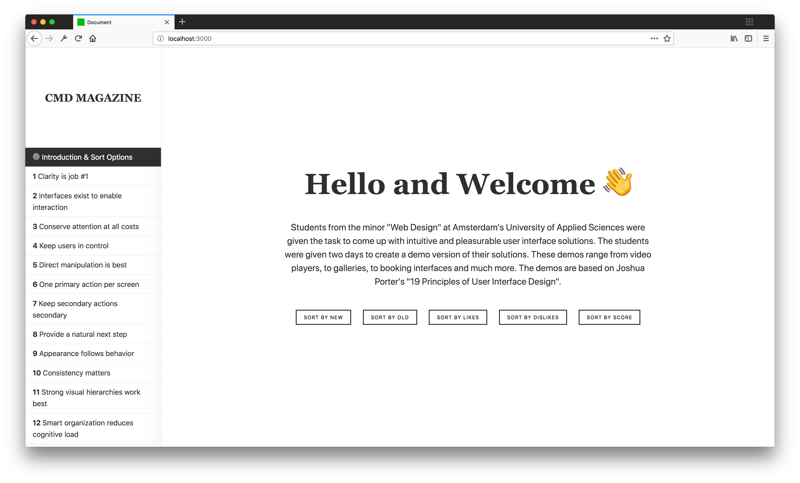
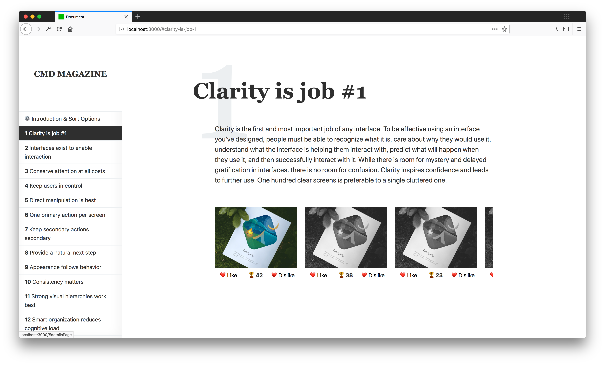
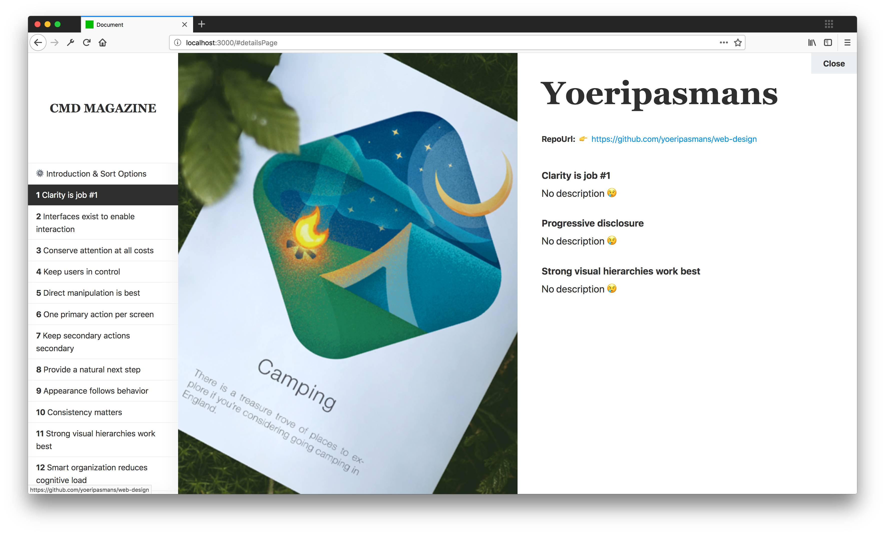

# Web Design: 19 Design Principles

Live deployed demo can be found [here](https://dist-dxjcojrvwp.now.sh/).

<!-- TOC -->

* [Web Design: 19 Design Principles](#web-design-19-design-principles)
  * [Getting Started](#getting-started)
    * [Installing](#installing)
    * [Usage](#usage)
  * [Project Description](#project-description)
    * [User 1: First & Second year CMD students](#user-1-first--second-year-cmd-students)
    * [User 2: Marijn Meijles (Motor Disabled)](#user-2-marijn-meijles-motor-disabled)
  * [User Scenarios](#user-scenarios)
  * [Image Gallery](#image-gallery)
    * [Welcome Page](#welcome-page)
    * [Overview Page](#overview-page)
    * [Details Page](#details-page)
  * [Functionality](#functionality)
  * [User Testing](#user-testing)
  * [TODOS & Roadmap](#todos--roadmap)

<!-- /TOC -->

## Getting Started

These instructions will get you a copy of the project up and running on your local machine for development and testing purposes.

### Installing

After cloning the repository you can install the required dependencies using npm:

```
$ cd project-2
$ npm install
```

### Usage

In order to launch a development environment:

```
$ npm start
```

In order to build the project for production porpuses:

```
$ npm build
```

## Project Description

While designing for the web, we always try to build cool stuff for an as large as possible audience, we try to include everyone. While this is a good thing, doing so also means that we rely on overused, boring and noncreative design patterns. For this project we had to design, prototype and test a website for two very specific people, and no I am not talking about a generalized persona, I am talking about real people. Doing so we hope to bring our creativity to the next level.

### User 1: First & Second year CMD students

Ok, my first user is not a single guy or girl. My first users are every first and second year CMD students that are currently learning about the 19 design principles. With this project, students can get a better idea of each principle thanks to a large number of examples built by fourth-year students. They can sort through them and even "like" the better examples.

### User 2: Marijn Meijles (Motor Disabled)

Marijn is a genius programmer, however, because of his motor disability he is extremely slow at typing and can't really handle a mouse like most of us. Whenever possible he should like to navigate through websites using his keyboard only, sadly this is almost never an option because we designers have no idea about what we are actually doing. For Marijn, I will build a pleasing, keyboard only navigation experience. (Other users can of course still use there mouse.)

## User Scenarios

* Marijn wants to navigate through the website using his keyboard only due to his disability.

* Marijn is a power-user that loves shortcuts (vim), because of this he and other power-users should like to navigate through the website using shortcuts.

* CMD students are learning about the 19 design principles, but there are currently no good examples to be found online, because of this they want a website where they can find good examples for each principle.

* CMD students are losing control, there are too many examples to be found, however, not all of them are equally good. The website should be more useful if they had a system that sorted the good examples from the bad examples.

* Every user should like to navigate through the website with more efficiency and in less time, multiple filters and sorting options should help them find what they are looking for faster.

## Image Gallery

### Welcome Page

<p align="center" style="margin: 2.5rem 0;">
  
</p>

This is the first screen that each user will see. On this screen, they can find a short project description and the 5 supported "Sort By" options. Clicking on one of them will redirect the user to the first design principle.

### Overview Page

<p align="center" style="margin: 2.5rem 0;">
  
</p>

Each overview page contains the principal name, its description, and a horizontally scrollable examples gallery where users can navigate through each example under the given principle. From here, users can navigate to the details page, like the example or dislike the example.

### Details Page

<p align="center" style="margin: 2.5rem 0;">
  
</p>

The details page is split into two halves. The first half features a huge cover art of the example. Where the other half contains information like the author's name, the repository where the example can be found and/or downloaded and every design principle applied by the author. Each with its own short description if applicable.

## Functionality

* Clean yet Fun design.
* Overview & Details page.
* Simple Like/Dislike system.
* Multiple advanced Sort options.
* Dynamic content creation functionality.
* Multiple functional animations that explain what is going on.
* Helpfull information for students that are learning about design.
* Full support for keyboard only navigation, with helpfull focus-states and userfriendly navigation order.

## User Testing

<p align="center" style="margin: 5rem 0;">
  
</p>

The user testing with Marijn Meijles was filmed on 25-04-2018. The original non-edited version can be found [here](https://www.youtube.com/watch?v=ahosCcJnr_U&feature=youtu.be).

I will be honest with you, the testing did not go as planned. First of all, this was my first time meeting Marijn and until now al we knew about him was that he didn't like/could use his trackpad/mouse. Because of this, he navigated web browsers using his tab key only, or so we thought. Multiple people from my class had to design something for him, we all focused on the tab key and focus states, however, when testing we rapidly noticed something. His speech was quite hard to understand, but that was not the real problem. The real problem was that he didn't use the tab key at all! He actually used his spacebar to scroll through content and sometimes he relied on his MacBook's trackpad. To be honest I didn't even know you could scroll with the spacebar...

Anyway, he actually enjoyed my prototype overall, there where however two problems that fucked up his experience a bit. First of all, I have a vertical scrollable navigation on the left side. This navigation is positioned fixed and a scrollbar appears when too many items are introduced, quite normal, right? Well because of the scrollbar Marijn could not use his spacebar in order to navigate through the content, the spacebar actually scrolled the navigation. The other problem where horizontal scrolling containers. In order to keep the page length as short as possible, I had built a horizontally scrollable container where users could scroll through every example for each principle. In this case, he had to use his trackpad.

After giving it some thoughts, I came up with the following solutions. Some of them were actually introduced to the current prototype, however, most of them were left out for the next time.

**Vertical Sidebar/Navigation:**

* [x] Try to make the menu items smaller in order to avoid the vertical scrollbar.
* [ ] I can force the focus state on the main content by default, doing so will force the spacebar to scroll the content and not the navigation. This should, however, introduce a problem. It will be harder to navigate to the navigation using the tab key. Using links that redirect the focus state back to the navigations could be a solution but this idea will need some testing.
* [ ] Avoid complex and long navigations. We could use dropdowns for example or simply avoid vertical navigations at all. (Keep it simple.)
* [ ] Avoid using position fix, this will eliminate the scrollbar but users will need to scroll back up in order to navigate. (I don't think this is a real fix.)
* [ ] Experiment using vertical navigations but then on the right side, this will force the browser to focus on the left side within this case is the main content.

**Horizontal scrollable containers:**

* [ ] Try to avoid them at all, for example, I could have split the page into multiple smaller ones where each principle had its own example page.
* [ ] Using JavaScript I could try to hijack the spacebar behavior in order to introduce horizontal scrolling support wherever needed. _(Not recommended.)_

## TODOS & Roadmap

* [x] Advanced Sort/Filter system.
* [ ] Shortkeys support for power-users.
* [ ] Cleanup/Rewrite the JavaScript codebase.
* [ ] Serverside support and database integration.
* [x] Simple Like/Dislike Functionality (Fake for now.)
* [x] Overview Page with the 19 design principles and their examples.
* [x] Example/Details Page where users can find more information about each example.
